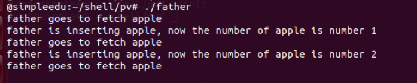
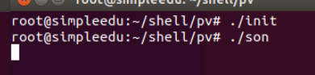
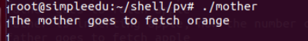
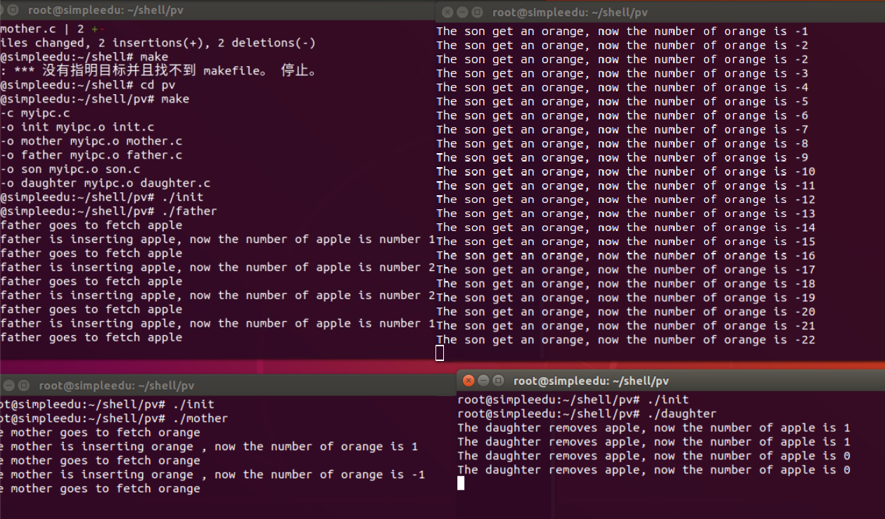
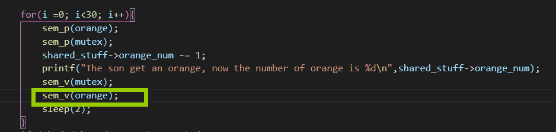
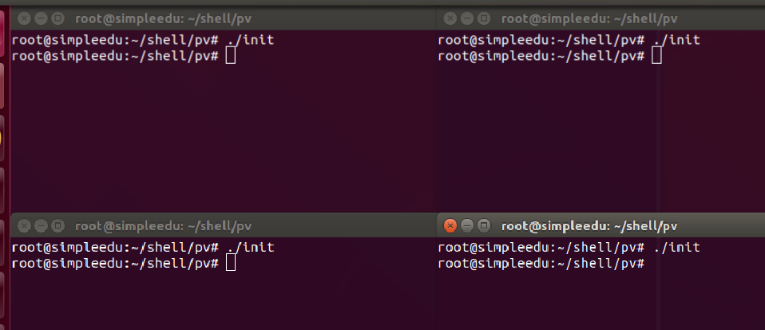
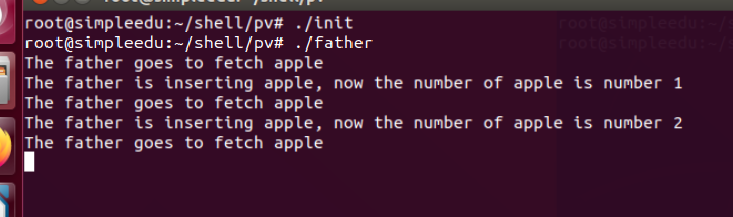
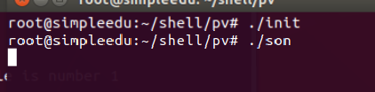
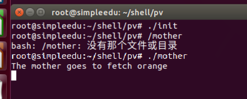
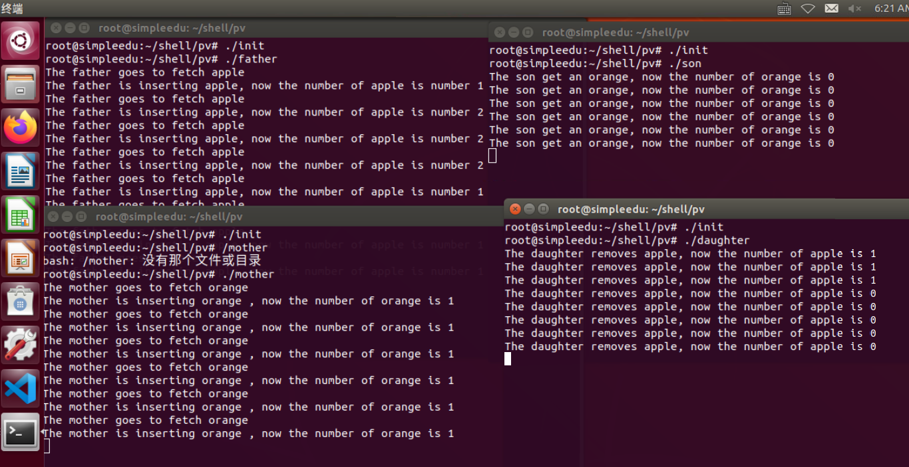

# 内容

桌子上有一只盘子，最多可容纳两个水果，每次只能放入或取出一个水果。爸爸专向
盘子放苹果（apple），妈妈专向盘子中放桔子（orange）；儿子专等吃盘子中的桔
子，女儿专等吃盘子中的苹果。请用P、V操作来实现爸爸、妈妈、儿子、女儿之间的
同步与互斥关系。 

# 试验

开始时，运行init之后先运行 father，father 放了两个苹果就 sleep 了

然后再运行 son，由于没有 orange， 所以 son 在 sleep

然后运行 mother ，mother 取了 orange 发现放不进篮子， 就 sleep 了

接着运行 daughter 

出现异常：儿子自从运行后就再也没 sleep；

debug：儿子拿完orange后应该v(empty), 而不应该v(orange)

修改之后再运行，先初始化每一个终端

运行father

运行son

运行mother

得到了正常的运行状态。